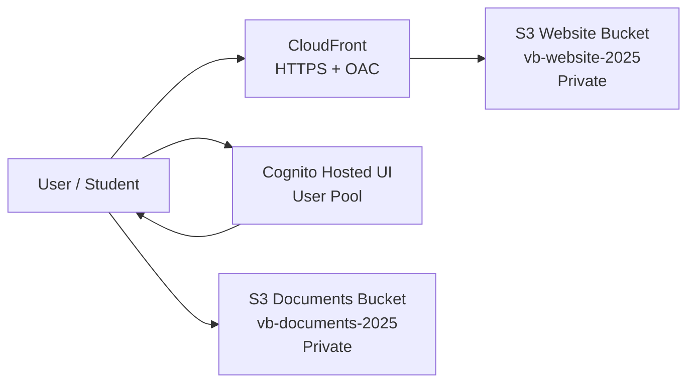

# Vocabulary Builder MVP

## Phase 1 — Foundation: Web Delivery, Storage & Authentication

**Status:** ✅ Completed  
**AWS Region:** `us-east-1`

---

## 1. Overview

Phase 1 establishes the secure AWS foundation for the Vocabulary Builder MVP.

The main goals of this phase were to:

- Deliver the frontend securely through AWS.
- Store user-uploaded documents in private storage.
- Implement managed user authentication.
- Separate website hosting from document storage.
- Establish a secure foundation for the processing pipeline added in later phases.

---

## 2. Architecture

Phase 1 uses the following AWS services:

- **Amazon S3** — website hosting and document storage.
- **Amazon CloudFront** — secure global delivery of the frontend.
- **Amazon Cognito** — user authentication.
- **Origin Access Control (OAC)** — secure CloudFront access to the private website bucket.

### Architecture Diagram



---

## 3. Amazon S3

Two separate S3 buckets were created.

| Bucket | Purpose |
|---|---|
| `vb-website-2025` | Static frontend |
| `vb-documents-2025` | User documents and processing outputs |

Separating website files from user documents provides clearer security boundaries and simplifies IAM permissions.

---

## 4. Website Bucket

### Bucket

`vb-website-2025`

### Purpose

Stores the static frontend files such as:

- HTML
- JavaScript
- CSS

### Security Configuration

- Block Public Access: **Enabled**
- Object Ownership: **BucketOwnerEnforced**
- Server-side encryption: **SSE-S3 (AES256)**
- Direct public access: **Disabled**

The bucket is not publicly accessible.

Website content is delivered through CloudFront using Origin Access Control.

---

## 5. CloudFront Distribution

Amazon CloudFront provides the public delivery layer for the frontend.

### Configuration

- Origin: `vb-website-2025`
- Origin Access Control: **Enabled**
- Signing protocol: **SigV4**
- Signing behavior: **Always**
- Viewer protocol policy: **Redirect HTTP to HTTPS**
- Default root object: `index.html`

### Result

Users access the website through CloudFront rather than directly through S3.

This provides:

- HTTPS delivery
- Global content distribution
- Private S3 origin
- Controlled access to website files

---

## 6. Documents Bucket

### Bucket

`vb-documents-2025`

### Purpose

Stores user-uploaded PDFs and processing outputs used by later phases of the application.

### Security Configuration

- Block Public Access: **Enabled**
- Server-side encryption: **SSE-S3**
- Versioning: **Enabled**
- ACLs: **Disabled**

### Storage Structure

```text
vb-documents-2025/
├── raw/
├── textract-output/
└── comprehend-output/
```

### Lifecycle Rules

| Prefix | Expiration |
|---|---:|
| `raw/` | 90 days |
| `textract-output/` | 730 days |
| `comprehend-output/` | 730 days |

These lifecycle policies help control long-term storage costs.

---

## 7. Authentication with Amazon Cognito

Amazon Cognito was configured to provide managed authentication for the application.

### Configuration

- User Pool authentication
- Email used as username
- Email auto-verification
- OAuth 2.0 Authorization Code flow
- PKCE enabled
- Cognito Hosted UI enabled

### Why Cognito Hosted UI?

Using the Hosted UI provides authentication without implementing custom password-handling logic in the frontend.

This allows the MVP to use AWS-managed authentication while keeping the frontend implementation simple.

---

## 8. Security Design

Security was part of the architecture from the beginning.

| Risk | Mitigation |
|---|---|
| Public S3 exposure | Block Public Access + CloudFront OAC |
| Direct website bucket access | CloudFront-only access |
| Password handling in frontend | Cognito Hosted UI |
| Excessive data retention | S3 lifecycle policies |
| Mixing website and user data | Separate S3 buckets |
| Data at rest | SSE-S3 encryption |

The architecture follows a private-by-default approach.

---

## 9. Phase 1 Scope

Phase 1 intentionally focused only on the infrastructure foundation.

The following components were **not part of Phase 1**:

- Lambda processing functions
- Amazon Textract processing
- DynamoDB job tracking
- AI exercise generation
- Processing-pipeline IAM roles

These capabilities were introduced in later phases.

---

## 10. Deployment Artifacts

Phase 1 produced infrastructure and configuration for:

- S3 website bucket
- S3 documents bucket
- S3 encryption and lifecycle rules
- CloudFront distribution
- CloudFront Origin Access Control
- Cognito User Pool
- Cognito Hosted UI

Supporting automation includes:

```text
scripts/
├── s3_setup.py
└── cloudfront_oac.py
```

and the Cognito infrastructure template.

---

## 11. Phase 1 Result

At the end of Phase 1:

- ✅ Website storage was configured.
- ✅ CloudFront delivery was operational.
- ✅ S3 origins remained private.
- ✅ Document storage was secured.
- ✅ Authentication was operational.
- ✅ Encryption and lifecycle policies were configured.
- ✅ The AWS foundation was ready for the document-processing pipeline.

---

## Status

**Phase 1: COMPLETE ✅**

The project was ready to move from infrastructure foundation to document processing.