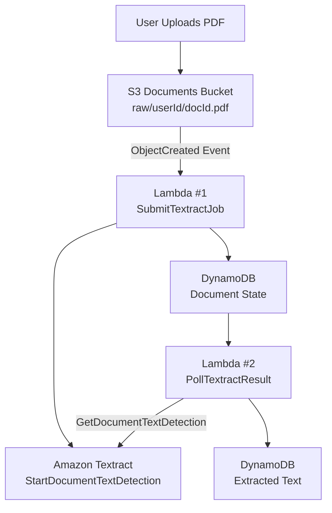

# Vocabulary Builder MVP

## Phase 2 — Asynchronous Document Processing with Amazon Textract

**Status:** ✅ Completed  
**AWS Region:** `us-east-1`

---

## 1. Overview

Phase 2 adds asynchronous PDF text extraction to the Vocabulary Builder MVP.

The goal of this phase is to allow users to upload real learning materials as PDF documents and automatically convert them into machine-readable text.

The extracted text becomes the foundation for later AI-powered features such as vocabulary extraction, exercise generation, difficulty classification, and personalization.

---

## 2. Why Asynchronous Processing?

PDF processing with Amazon Textract can take seconds or minutes.

Instead of keeping a Lambda function running while waiting for Textract, the system separates job submission from result retrieval.

The processing flow is:

1. Submit the Textract job.
2. Store the job state.
3. Continue without waiting.
4. Retrieve the result when processing is complete.
5. Store the extracted text.

This approach provides:

- Better scalability
- Reduced risk of Lambda timeouts
- Clear document-state tracking
- Easier retry and monitoring
- Separation of responsibilities

---

## 3. Architecture



---

## 4. PDF Upload

Uploaded PDFs are stored in the private documents bucket created during Phase 1.

### S3 Path

```text
s3://vb-documents-2025/raw/<sub>/<docId>.pdf
```

The path identifies:

- The user (`sub`)
- The document (`docId`)

An S3 `ObjectCreated` event starts the processing workflow.

---

## 5. Lambda #1 — SubmitTextractJob

### Responsibility

Submit the PDF to Amazon Textract and record the processing state.

### Trigger

```text
S3 ObjectCreated
```

### Processing

The Lambda function:

1. Receives the S3 event.
2. Validates the object key structure.
3. Identifies the user and document.
4. Calls:

```text
StartDocumentTextDetection
```

5. Stores the Textract job metadata in DynamoDB.

### Stored State

```text
textractJobId
status = TEXTRACT_SUBMITTED
s3Key
timestamps
```

### Design Reason

This Lambda only submits the job.

It does **not** wait for Textract to finish.

This keeps the upload workflow fast and prevents unnecessary Lambda execution time.

---

## 6. Lambda #2 — PollTextractResult

### Responsibility

Retrieve the completed Textract result and convert it into plain text.

### Trigger

During this phase, result retrieval was designed for:

```text
Manual / EventBridge
```

with future orchestration improvements possible.

### Processing

The Lambda:

1. Reads the Textract job ID.
2. Calls:

```text
GetDocumentTextDetection
```

3. Handles Textract pagination using:

```text
NextToken
```

4. Extracts text from `LINE` blocks.
5. Combines the extracted lines into plain text.
6. Updates the document record in DynamoDB.

### Final State

```text
status = TEXTRACT_DONE
textractText = extracted document text
```

---

## 7. DynamoDB State Lifecycle

Each document moves through explicit processing states.

| Status | Meaning |
|---|---|
| `TEXTRACT_SUBMITTED` | Document was submitted to Textract |
| `TEXTRACT_DONE` | Text extraction completed successfully |
| `ERROR` | Processing failed and can be retried |

This state-based design makes the workflow easier to:

- Monitor
- Debug
- Retry
- Extend in later phases

---

## 8. Separation of Responsibilities

The processing logic is deliberately divided between two Lambda functions.

| Lambda | Responsibility |
|---|---|
| `SubmitTextractJob` | Submit the Textract job |
| `PollTextractResult` | Retrieve and process the result |

No single Lambda performs the entire workflow.

This improves:

- Scalability
- Debugging
- Reliability
- Maintainability

---

## 9. Security

Both Lambda functions use scoped IAM permissions.

### SubmitTextractJob

Required permissions include:

```text
textract:StartDocumentTextDetection
s3:GetObject
dynamodb:UpdateItem
```

### PollTextractResult

Required permissions include:

```text
textract:GetDocumentTextDetection
dynamodb:GetItem
dynamodb:UpdateItem
```

The architecture continues the private-by-default security model established in Phase 1.

- No public document access
- Private S3 storage
- IAM-controlled service access
- Least-privilege permissions

---

## 10. Error Handling & Reliability

Phase 2 introduces several reliability mechanisms:

- Invalid files are rejected early.
- Textract failures can be recorded in the document state.
- DynamoDB state prevents uncontrolled processing.
- Failed jobs can be retried.
- Textract pagination is handled using `NextToken`.

---

## 11. Phase 2 Result

At the end of Phase 2, the Vocabulary Builder can:

- ✅ Accept uploaded PDF learning materials.
- ✅ Start asynchronous Textract jobs.
- ✅ Track document-processing state.
- ✅ Retrieve multi-page Textract results.
- ✅ Convert Textract `LINE` blocks into plain text.
- ✅ Store extracted text in DynamoDB.
- ✅ Produce machine-readable content for later AI processing.

---

## 12. Phase 2 Scope

Phase 2 focuses specifically on **document-to-text processing**.

The output of this phase is:

```text
PDF
 ↓
Amazon Textract
 ↓
Extracted Text
 ↓
DynamoDB
```

AI exercise generation and other learning features are handled in later phases.

---

## Status

**Phase 2: COMPLETE ✅**

The project now has an asynchronous document-processing foundation ready for the next stage of the Vocabulary Builder pipeline.