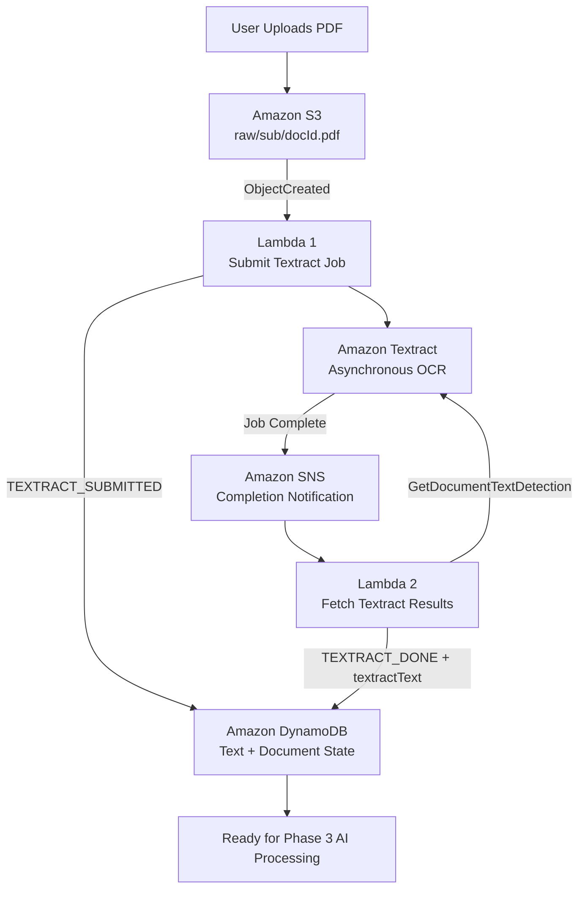

# Vocabulary Builder MVP

## Phase 2 — Document Processing Architecture & Workflow

**Status:** ✅ Completed  
**AWS Region:** `us-east-1`

---

## 1. Phase 2 Overview

Phase 2 introduced the document-processing pipeline for the Vocabulary Builder MVP.

The primary objective was to transform user-uploaded PDF documents into extracted text that could later be processed by the AI layer.

```text
PDF → Text → Ready for AI
```

This phase uses an asynchronous, event-driven architecture with managed AWS services.

---

## 2. Phase 2 Architecture



The architecture separates job submission, document processing, completion notification, result retrieval, and state storage into independent components.

---

## 3. Amazon S3

Amazon S3 is the document storage layer.

Bucket:

```text
vb-documents-2025
```

Document key:

```text
raw/<sub>/<docId>.pdf
```

The `raw/` prefix contains newly uploaded documents entering the processing pipeline. An S3 `ObjectCreated` event invokes Lambda 1.

---

## 4. AWS Lambda — Lambda 1

Lambda 1 starts the document-processing workflow.

Responsibilities:

- Receive the S3 upload event.
- Read and validate the S3 object key.
- Extract the Cognito user identifier (`sub`).
- Determine the document identifier (`docId`).
- Submit an asynchronous Textract job using `StartDocumentTextDetection`.
- Receive the Textract `JobId`.
- Record the initial processing state in DynamoDB.

After submission:

```text
status = TEXTRACT_SUBMITTED
```

Lambda 1 does not wait for Textract to finish.

---

## 5. Amazon Textract

Amazon Textract provides the OCR/document text extraction layer.

```text
Lambda 1
  ↓
StartDocumentTextDetection
  ↓
Textract JobId
```

Textract processes the PDF independently. This avoids keeping Lambda running while document processing is in progress.

---

## 6. Amazon SNS

Amazon SNS provides the asynchronous notification layer between Textract and Lambda 2.

```text
Textract Processing
  ↓
Job Completed
  ↓
SNS Notification
  ↓
Lambda 2 Triggered
```

SNS eliminates the need to poll Textract continuously.

---

## 7. AWS Lambda — Lambda 2

Lambda 2 retrieves completed Textract results after the SNS notification arrives.

Responsibilities:

- Receive the SNS event.
- Parse the Textract completion message.
- Read the Textract `JobId`.
- Read `DocumentLocation.S3ObjectName` and derive `sub` and `docId` from the S3 key.
- Call `GetDocumentTextDetection`.
- Handle pagination using `NextToken`.
- Process Textract blocks.
- Select `LINE` blocks.
- Combine extracted lines into plain text.
- Store the text in DynamoDB as `textractText`.
- Update the document state to `TEXTRACT_DONE`.

The result is a complete plain-text representation of the uploaded PDF.

---

## 8. Amazon DynamoDB

DynamoDB is the persistent state and document metadata store.

Single-table key design:

```text
PK = USER#<sub>
SK = PDF#<docId>
```

The document record can contain:

```text
status
textractJobId
s3Key
updatedAt
textractText
```

This allows document state to persist independently of individual Lambda executions.

---

## 9. Document State Lifecycle

```text
TEXTRACT_SUBMITTED
        ↓
TEXTRACT_DONE
        ↓
EXERCISES_DONE
```

Phase 2 is responsible for reaching:

```text
TEXTRACT_DONE
```

At that point, the extracted text is ready for the AI-processing stage.

---

## 10. End-to-End Phase 2 Workflow

1. **PDF Upload** — The PDF is stored at `s3://vb-documents-2025/raw/<sub>/<docId>.pdf`.
2. **S3 Event** — S3 generates an `ObjectCreated` event and invokes Lambda 1.
3. **Submit Textract Job** — Lambda 1 calls `StartDocumentTextDetection`, receives a `JobId`, stores it, and sets `TEXTRACT_SUBMITTED`.
4. **Document Processing** — Textract processes the PDF asynchronously.
5. **Completion Notification** — Textract publishes the completion notification to SNS.
6. **Lambda 2 Invocation** — SNS invokes Lambda 2.
7. **Retrieve Results** — Lambda 2 calls `GetDocumentTextDetection` and follows `NextToken` until all result pages are retrieved.
8. **Build Plain Text** — Lambda 2 selects `BlockType = LINE` and joins the lines.
9. **Store Result** — Lambda 2 writes `textractText` and sets `status = TEXTRACT_DONE`.

---

## 11. Architectural Design

A major Phase 2 design decision was separating document submission from result retrieval.

Instead of:

```text
Upload → Lambda → Submit Textract → Wait → Fetch Result
```

the architecture uses:

```text
Upload
  ↓
Lambda 1
  ↓
Textract
  ↓
SNS
  ↓
Lambda 2
  ↓
DynamoDB
```

This creates a loosely coupled, event-driven document-processing pipeline.

---

## 12. Why the Architecture Is Asynchronous

Document processing is not guaranteed to complete immediately. Keeping a Lambda function running while waiting would unnecessarily couple Lambda execution time to Textract processing time.

The asynchronous pattern is:

```text
Submit → Exit → Process → Notify → Continue
```

Each AWS service performs its responsibility independently, providing a foundation for later event-driven processing stages.

---

## 13. Phase 2 Result

At the completion of Phase 2, Vocabulary Builder can:

- Receive PDF documents.
- Store them securely in Amazon S3.
- Automatically start document processing.
- Extract text with Amazon Textract.
- Receive asynchronous completion notifications through SNS.
- Retrieve multi-page Textract results.
- Convert Textract blocks into plain text.
- Persist document state in DynamoDB.
- Store `textractText` for downstream processing.

Final output:

```text
Uploaded PDF
     ↓
Extracted Text
     ↓
Stored Application State
     ↓
Ready for AI
```

---

## 14. Transition to Phase 3

Phase 2 ends when the document reaches:

```text
TEXTRACT_DONE
```

Phase 3 consumes `textractText` and extends the pipeline into AI exercise generation.

```text
PDF
 ↓
Textract
 ↓
Extracted Text
 ↓
AI Processing
 ↓
Generated Exercises
```

**Phase 2: COMPLETE ✅**
