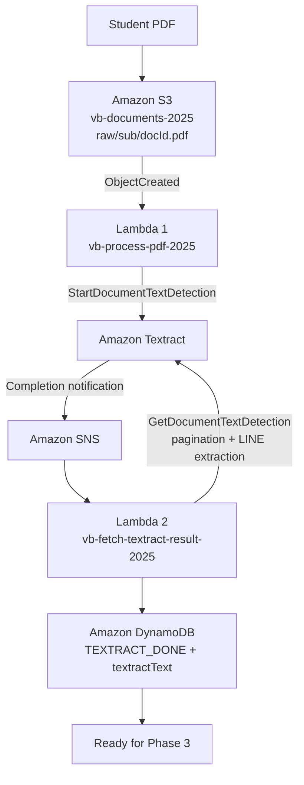

# Vocabulary Builder MVP

## Phase 2 — Engineering Troubleshooting Report

**Architecture:** S3 → Lambda 1 → Amazon Textract → Amazon SNS → Lambda 2 → Amazon DynamoDB  
**Status:** Resolved / Completed

---

## Project Context

Phase 2 introduced the asynchronous document-processing pipeline for the Vocabulary Builder MVP. Its objective was to transform uploaded PDF documents into clean text that could later be consumed by the AI exercise-generation stage.

```text
PDF Upload
    ↓
Amazon S3
    ↓
Lambda 1 — vb-process-pdf-2025
    ↓
Amazon Textract
    ↓
Amazon SNS
    ↓
Lambda 2 — vb-fetch-textract-result-2025
    ↓
Amazon DynamoDB
    ↓
TEXTRACT_DONE + textractText
```

During implementation, several engineering problems appeared around asynchronous processing, service-to-service IAM permissions, Textract request validation, SNS notifications, event handling, pagination, workflow state tracking, idempotency, and document identity.

---

## 1. Textract Async Job Submission Failure

### Problem

Lambda 1 attempted to start an asynchronous Textract job using `StartDocumentTextDetection`, but the request repeatedly failed.

### Observed Error

```text
InvalidParameterException
Request has invalid parameters
```

No `JobId` was generated.

### Failed Troubleshooting Attempts

Before the actual cause was identified, the following were investigated:

- PDF validity.
- S3 bucket and object path.
- Textract permissions.
- AWS Region consistency.
- PDF filenames.
- SNS configuration.
- Multiple test PDFs.

These checks were useful for eliminating possible causes, but none solved the error.

### Root Cause

The `JobTag` contained:

```javascript
JobTag: `${sub}#${docId}`
```

The `#` character made the value invalid for the Textract request. Textract returned a generic `InvalidParameterException` rather than identifying `JobTag` as the failing parameter.

### Solution Applied

The tag was simplified to:

```javascript
JobTag: docId
```

After removing the unsupported character, Textract accepted the job.

### Engineering Lesson

Generic AWS errors do not necessarily identify the real failing component. Reduce request complexity, remove optional parameters, test the minimum working request, and add components back incrementally.

---

## 2. Textract → SNS NotificationChannel Failure

### Problem

Textract could operate without SNS notification configuration, but after `NotificationChannel` was introduced the asynchronous pipeline failed to continue correctly. Lambda 2 did not execute.

### Failed Troubleshooting Attempts

Initial investigation focused on:

- Lambda execution-role permissions.
- Whether the SNS topic existed.
- Lambda-side authorization.

The important missing question was: **Which AWS principal is actually publishing to SNS?**

### Root Cause

The Lambda execution role does not publish the Textract completion notification. Textract itself publishes the message and must assume the IAM role supplied in:

```text
NotificationChannel.RoleArn
```

The integration therefore required the correct trust relationship and SNS permissions for Textract.

### Solution Applied

A dedicated Textract/SNS IAM role was configured with:

- Trust for `textract.amazonaws.com`.
- `sns:Publish` permission.
- The correct SNS topic ARN.
- An SNS topic policy that permits the required publish operation.

### Engineering Lesson

Service-to-service IAM authorization is independent from the Lambda execution role. Always identify the AWS principal performing the API action.

---

## 3. Asynchronous Textract Architecture Misunderstanding

### Problem

There was initially an expectation that `StartDocumentTextDetection` would return the extracted document text immediately.

### Root Cause

Textract PDF processing is asynchronous. `StartDocumentTextDetection` starts a background job and returns a `JobId`; the final text must be retrieved later after processing completes.

### Solution Applied

The workflow was redesigned around asynchronous events:

```text
S3
 ↓
Lambda 1
 ↓
Textract
 ↓
SNS
 ↓
Lambda 2
 ↓
GetDocumentTextDetection
 ↓
DynamoDB
```

### Engineering Lesson

Serverless systems often require event-driven thinking rather than synchronous request/response assumptions.

---

## 4. SNS Message Parsing in Lambda 2

### Problem

Lambda 2 receives an SNS event, but the Textract completion information is not located directly at the Lambda event root.

### Root Cause

Textract information is serialized inside:

```javascript
record.Sns.Message
```

The handler therefore has to parse the SNS envelope before it can process the Textract notification.

### Solution Applied

Lambda 2:

1. Parses `JSON.parse(record.Sns.Message)`.
2. Reads `JobId`, `Status`, `JobTag`, and `DocumentLocation`.
3. Validates required fields.
4. Ignores malformed or unsuccessful notifications.
5. Continues only for a successful Textract job.

### Engineering Lesson

Event-driven Lambda functions should **parse → validate → filter → process** rather than assuming incoming event structure is already application-ready.

---

## 5. Textract Result Pagination

### Problem

`GetDocumentTextDetection` does not guarantee that the entire document result will be returned in one response.

### Root Cause

Larger results can contain a `NextToken`. Processing only the first response could silently produce incomplete text.

### Solution Applied

Lambda 2 loops while `NextToken` exists and appends all returned `Blocks` before text extraction.

Conceptually:

```text
GetDocumentTextDetection
        ↓
Blocks + NextToken?
        ↓ yes
Fetch next page
        ↓
Repeat until no NextToken
```

### Engineering Lesson

A successful AWS API response does not necessarily mean the complete dataset has been returned. Pagination must be handled explicitly.

---

## 6. Converting Textract Blocks into Usable Text

### Problem

Textract returns structured `Blocks`, while the next application stage requires clean plain text.

### Root Cause

The raw Textract response contains multiple block types and more document structure than the Vocabulary Builder needs at this stage.

### Solution Applied

Lambda 2 filters blocks where:

```text
BlockType = LINE
```

and `Text` is present, maps those blocks to their text values, and joins them with newline characters.

The resulting text is stored as:

```text
textractText
```

### Engineering Lesson

Managed AI-service output often requires a normalization layer. Preserve only the structure required by downstream application stages when additional structure is unnecessary.

---

## 7. DynamoDB Job Tracking

### Problem

Once Textract became asynchronous, the system needed a reliable way to associate documents with jobs and track processing state across separate Lambda executions.

### Failed Troubleshooting Approaches

Relying only on:

- The Textract console.
- CloudTrail.
- CloudWatch logs.

did not provide a clean application-level workflow state.

### Root Cause

Textract is the document-processing service, not the application's historical workflow database. The application must persist its own orchestration metadata.

### Solution Applied

DynamoDB became the workflow state store.

Key design:

```text
PK = USER#<sub>
SK = PDF#<docId>
```

Lambda 1 records values including:

```text
status = TEXTRACT_SUBMITTED
textractJobId
s3Key
updatedAt
```

Lambda 2 updates the same document with:

```text
status = TEXTRACT_DONE
textractText
updatedAt
```

### Engineering Lesson

DynamoDB can act as application storage, asynchronous workflow state store, distributed job tracker, and orchestration metadata layer.

---

## 8. Preventing Duplicate or Invalid State Updates

### Problem

Distributed event-driven systems can receive repeated events. Reprocessing the same document could create unnecessary Textract jobs or overwrite active workflow state.

### Root Cause

The workflow required idempotency protection rather than assuming every event would occur exactly once.

### Solution Applied

Lambda 1 uses a DynamoDB conditional write similar to:

```text
attribute_not_exists(#status) OR #status = :err
```

A new processing job is therefore allowed only when no status exists or the previous state is `ERROR`.

### Engineering Lesson

Duplicate delivery is a normal distributed-systems concern. Idempotency and conditional writes should be designed into event-driven workflows from the beginning.

---

## 9. Document Identity and Multi-User Correlation — Resolved

### Original Problem

After simplifying `JobTag` to `docId`, an early test implementation no longer carried the Cognito user's `sub` inside the tag. During controlled testing, Lambda 2 temporarily used:

```javascript
const sub = "test-user-1";
```

This was sufficient to validate the end-to-end pipeline but was not suitable for a multi-user implementation.

### Root Cause

Using `JobTag` as both a Textract tag and a container for user/document identity coupled two separate responsibilities. The invalid-character problem demonstrated why user correlation should not depend on encoding the Cognito `sub` into `JobTag`.

### Final Solution

The current Lambda 2 implementation reads:

```javascript
snsMessage.DocumentLocation?.S3ObjectName
```

The S3 key follows:

```text
raw/<sub>/<docId>.pdf
```

Lambda 2 decodes and parses that key to derive both:

```text
sub
docId
```

It then updates the correct DynamoDB item:

```text
PK = USER#<sub>
SK = PDF#<docId>
```

The hardcoded `test-user-1` workaround is therefore **historical and resolved**, not a current production limitation.

### Engineering Lesson

Keep document identity in a stable application-controlled identifier. Temporary test shortcuts are useful for isolating a pipeline, but final multi-user correlation must be deterministic and derived from trusted workflow data.

---

## 10. Lambda Decomposition Strategy

### Design Question

A possible implementation was to let one Lambda submit the Textract job, wait for completion, retrieve the results, normalize the text, and update DynamoDB.

### Why That Was Rejected

Textract processing duration is independent of Lambda execution. Keeping one Lambda alive while waiting would tightly couple compute duration to an external asynchronous service and make timeout, retry, and failure handling harder.

### Final Design

Responsibilities were separated:

**Lambda 1 — `vb-process-pdf-2025`**

- Handles the S3 upload event.
- Validates document identity.
- Starts Textract.
- Stores `TEXTRACT_SUBMITTED`.

**Amazon Textract**

- Performs asynchronous OCR.

**Amazon SNS**

- Provides the completion event.

**Lambda 2 — `vb-fetch-textract-result-2025`**

- Handles the SNS notification.
- Retrieves all Textract result pages.
- Normalizes `LINE` blocks.
- Stores `textractText`.
- Sets `TEXTRACT_DONE`.

### Engineering Lesson

Decompose serverless components around event boundaries and responsibility boundaries. Small functions are easier to reason about, retry, observe, secure, and evolve.

---

## Phase 2 Final Architecture



The clean Phase 2 boundary is:

```text
Input:  PDF
Output: TEXTRACT_DONE + textractText
```

Phase 3 can consume `textractText` without needing to understand Textract job orchestration.

---

## Most Valuable Engineering Lessons from Phase 2

- **Debug the smallest possible AWS request.** A generic `InvalidParameterException` ultimately came from one request parameter.
- **Identify the acting IAM principal.** Textract publishing to SNS is different from Lambda executing AWS API calls.
- **Use asynchronous services asynchronously.** SNS is the continuation point after Textract completes.
- **Persist workflow state.** DynamoDB makes disconnected asynchronous operations traceable.
- **Handle pagination explicitly.** A successful response may be only one page of the result.
- **Validate event envelopes.** SNS messages must be parsed and filtered before application processing.
- **Design for retries and duplicate events.** Idempotency is part of the architecture, not an afterthought.
- **Separate temporary debugging shortcuts from final architecture.** The early `test-user-1` shortcut was replaced by deterministic identity extraction from the S3 key.
- **Decompose by responsibility.** Lambda 1 submits work; Lambda 2 consumes the completion event and retrieves results.

---

## Phase 2 Result

Phase 2 produced a functioning asynchronous, event-driven PDF-to-text pipeline.

```text
PDF Upload
    ↓
S3
    ↓
Lambda 1
    ↓
Textract
    ↓
SNS
    ↓
Lambda 2
    ↓
DynamoDB
    ↓
TEXTRACT_DONE + textractText
    ↓
Ready for Phase 3
```

**Phase 2 Troubleshooting: COMPLETE ✅**
